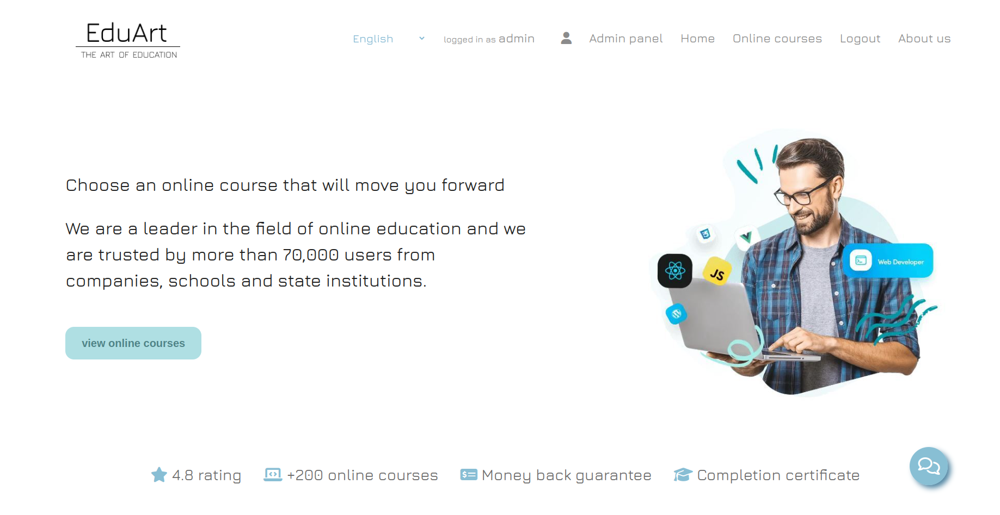
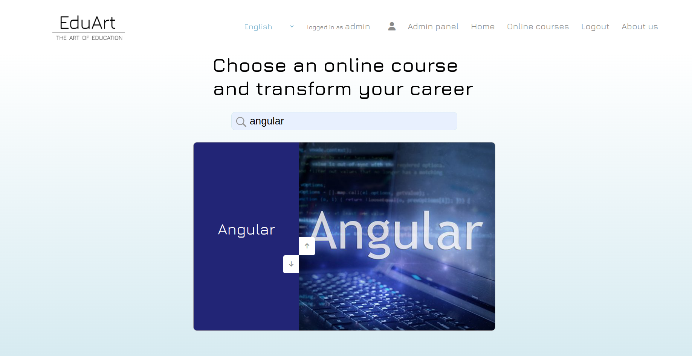
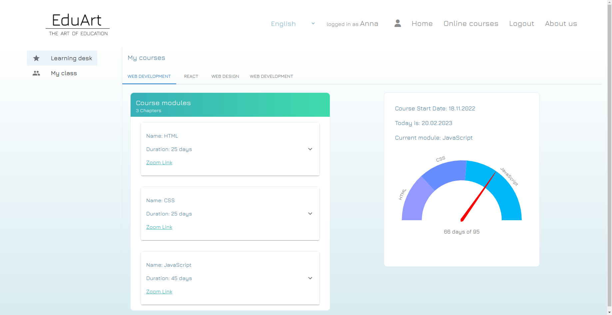
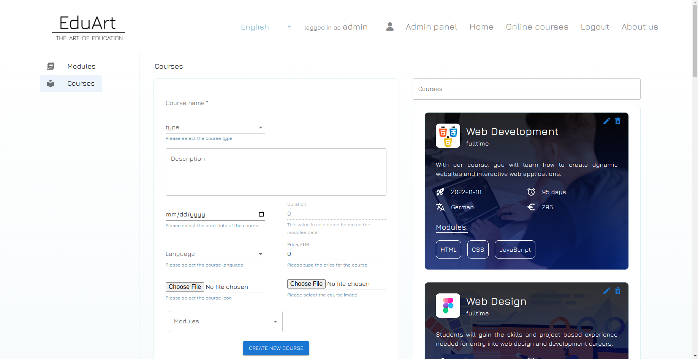
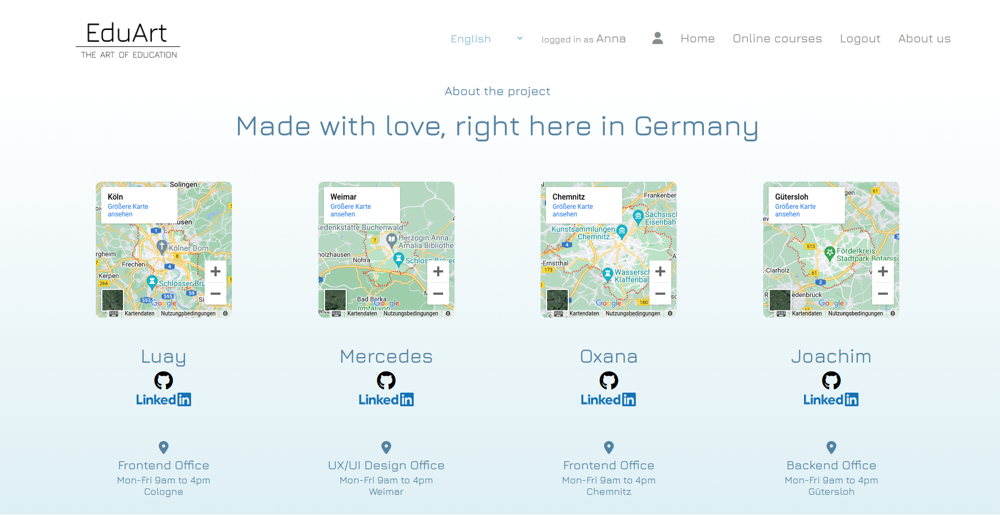

# Project name: EduArt

This is the final team project of the Web Development course at the Digital Career Institute.

---

## Description

_**EduArt** - **The Art of Education** is an e-learning platform and online campus. This application can be used for online learning centers to create courses and modules. Each student has a profile and a Learning Desk page. You can find all booked courses, personal information, invoices, and more here. There are several roles for users: Guest, Student, and Administrator. According to the role the user is given appropriate access to the web application. In addition, you can use three languages: English, Russian and German._

---

[Video](https://youtu.be/YqVZnRgwgsc)

---

---

## Technologies

HTML5,CSS3, JavaScript, React, Flexbox Layout, React Router v6, Material UI, Node.js, Express.js, Mongo DB

---

## Team

UI/UX:

[Mercedes Girmanova](https://www.linkedin.com/in/mercedes-girmanova/)

Frontend Development:

[Oxana Danilova](https://www.linkedin.com/in/oxana-danilova-b082a0156/)

[Luay Abbas](https://www.linkedin.com/in/luay-abbas-79531a24a/)

Backend Development:

[Joachim Ritter](https://www.linkedin.com/in/joachimr/)

---

Made with ❤️
